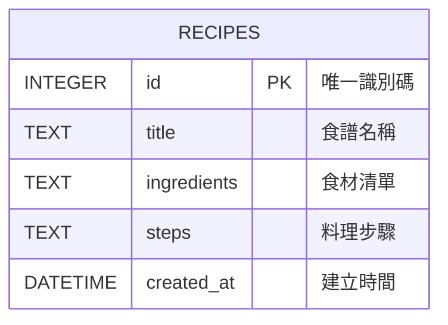

# 資料庫設計：食譜管理系統

本文件基於 `docs/PRD.md` 與 `docs/FLOWCHART.md`，定義系統（MVP 階段）所需的 SQLite 資料表結構與關聯。

## 1. ER 圖（實體關係圖）

由於目前採用極簡的 MVP 設計，我們專注於單一 `recipes` 資料表，將食材與步驟皆作為文字直接儲存在該資料表中。

## 2. 資料表詳細說明

### `recipes` 資料表

負責儲存所有的食譜資訊。

| 欄位名稱 | 型別 | 必填 | 說明 |
| :--- | :--- | :---: | :--- |
| `id` | INTEGER | ✔ | Primary Key，自動遞增，作為每筆食譜的唯一識別碼。 |
| `title` | TEXT | ✔ | 食譜的名稱（例如：「番茄炒蛋」）。 |
| `ingredients` | TEXT | ✔ | 食材清單。為降低複雜度，以一般文字或換行分隔的方式儲存。 |
| `steps` | TEXT | ✔ | 食譜的製作步驟說明。 |
| `created_at` | DATETIME | ✔ | 該筆食譜被建立的時間，預設為資料庫當下時間（`CURRENT_TIMESTAMP`）。 |
