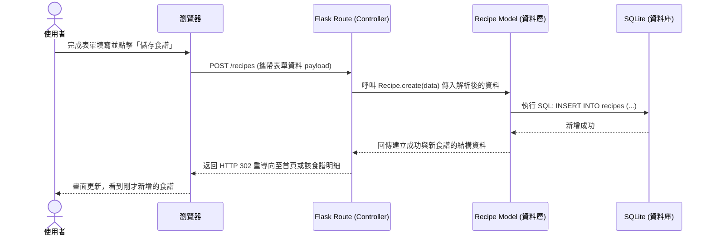

# 流程圖設計：食譜管理系統

本文件基於產品需求文件 (`docs/PRD.md`) 與系統架構文件 (`docs/ARCHITECTURE.md`)，視覺化使用者的操作路徑與系統內部的資料流動，並盤點所有需要開發的路由與功能。

## 1. 使用者流程圖（User Flow）

此流程圖描述使用者從開啟網站開始，如何操作食譜管理系統的各項主要功能（包含新增、查看、搜尋、推薦、編輯與刪除）。

```mermaid
flowchart LR
    A([使用者開啟系統]) --> B[首頁 / 食譜總覽]
    
    B --> C{選擇主要操作}
    
    %% 新增食譜流程
    C -->|新增| D[進入新增頁面]
    D --> E[填寫食譜內容\n(名稱、食材、步驟)]
    E --> F[送出並儲存]
    F --> B
    
    %% 搜尋與推薦流程
    C -->|關鍵字搜尋| G[輸入食譜名稱]
    C -->|清理冰箱| H[輸入剩餘食材]
    G --> I[查看搜尋/推薦結果]
    H --> I
    I -->|點選| J[食譜明細頁面]
    
    %% 查看明細與後續操作
    C -->|直接瀏覽預設清單| J
    J --> K{後續操作}
    
    K -->|編輯| L[進入編輯頁面]
    L --> M[修改內容並送出]
    M --> J
    
    K -->|刪除| N[同意確認刪除]
    N --> B
    K -->|返回| B
```

## 2. 系統序列圖（Sequence Diagram）

以下序列圖以「新增食譜功能」為例，展示從使用者在瀏覽器送出表單，到資料實際存入資料庫的完整互動過程：



## 3. 功能清單對照表

此對照表彙整了系統中所需實作的所有功能、對應的 URL 規則以及 HTTP 請求方法，作為後續「路由與 API 設計」階段的基礎參考：

| 功能項目說明 | URL 路徑 | HTTP 方法 | 備註說明 |
| :--- | :--- | :--- | :--- |
| **食譜總覽 (首頁)** | `/` 或 `/recipes` | `GET` | 列出目前存放的所有食譜 |
| **進入新增食譜表單** | `/recipes/new` | `GET` | 回傳 HTML 表單頁面 |
| **執行儲存新食譜** | `/recipes` | `POST` | 接收表單並寫入資料庫 |
| **查看食譜明細** | `/recipes/<id>` | `GET` | 透過 ID 取得單一食譜的所有內容 |
| **進入編輯食譜表單** | `/recipes/<id>/edit` | `GET` | 帶有原始資料的修改表單頁面 |
| **執行更新食譜** | `/recipes/<id>/edit` | `POST` | 覆蓋舊資料（使用 POST 兼容基本 HTML 表單）|
| **執行刪除食譜** | `/recipes/<id>/delete`| `POST` | 安全起見，刪除動作使用 POST |
| **關鍵字搜尋食譜** | `/search` | `GET` | 透過 `?q=關鍵字` 進行名稱搜尋 |
| **剩餘食材推薦** | `/recommend` | `GET` | 透過 `?ingredients=食材` 進行比對推薦 |

> 註：傳統 HTML `<form>` 僅支援 `GET` 和 `POST`，因此這裡在編輯與刪除操作上我們選用 `POST` 並搭配特定的動作路徑（`/edit`, `/delete`），以符合不依賴純 JavaScript Fetch/Ajax 的簡單架構實作。
